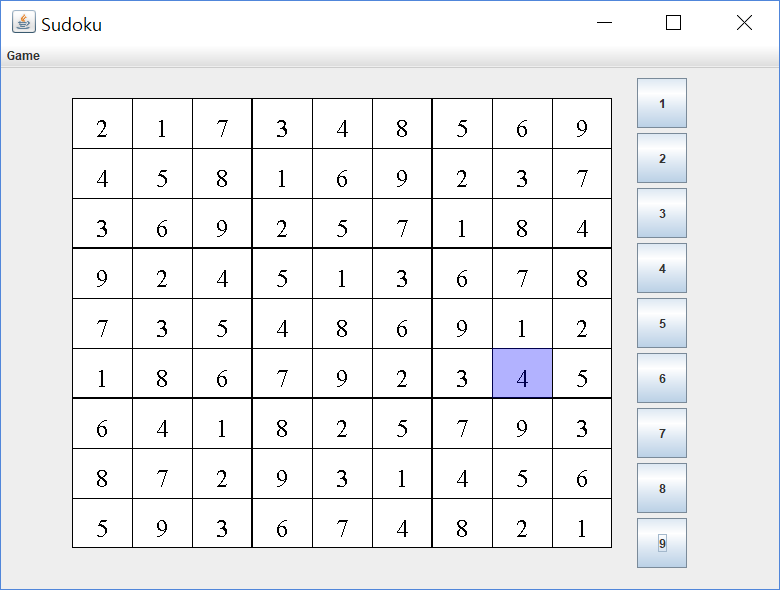

# grade2_java-project

## 프로젝트 일정
1. 09월         
    - java gui 공부     
    - java gui 스도쿠 프로젝트      
2. 10월         
    - android sming 프로젝트        
3. 11월     
    - java 숫자야구 프로젝트 완료       
    - android sming 프로젝트        
    - android memo 프로젝트     
4. 12월          
    - android memo 프로젝트     
    - java gui sudoku 프로젝트      

    
## 02 SUDOKU 

## 04 숫자야구
[숫자야구 실행 동영상](https://www.youtube.com/watch?v=lX_GYyF9xDI)

## 05 안드로이드 메모 어플 실행 동영상 
[메모 어플 실행 동영상](https://www.youtube.com/watch?v=gsM4UpjwOpM)
